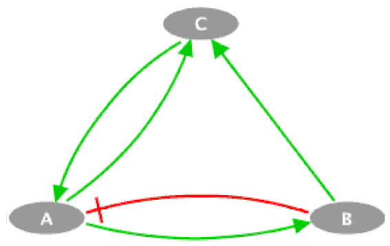

### Table 1. Network for aging study 
#### (**A**) Regulation network
A regulation network is a network that contains information about activation and inhibition, but it does not contain information about logic functions. `A, +1, B` means that A activates B, and` B, -1, C` means that B inhibits C.

