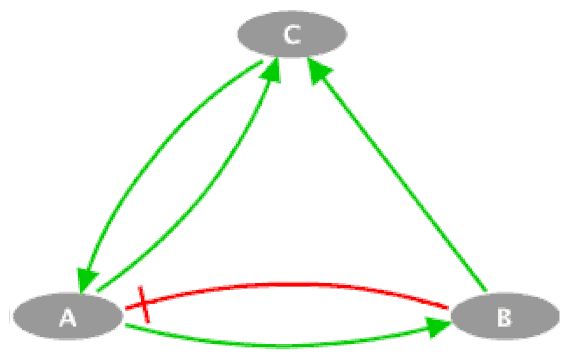

### Table 2. Test aging model (Loic et al., 2016)
This result is related to [#11](https://github.com/jehoons/sbie_aging/issues/11).

#### (**A**) Test toy model

This model is a simple toy model provided by MaBoSS. The `.bnd` file defines the simulation model, and `.cfg` defines the configuration how the simulation model runs. One or more `.cfg` files may exist for a ` .bnd` file.

<p align=center>
<br>
Toy model with three nodes
</p>

The code that describes the toy model is as follows:
```
Node C
{
    rate_up=0.0;
    rate_down=((not A) and (not B)) ? $escape : 0.0;
}

Node A
{
    rate_up=(C and (not B)) ? $Au : 0.0;
    rate_down=B ? $Ad : 0.0;
}

Node B
{
    rate_up=A ? $Au : 0.0;
    rate_down=A ? 0.0 : $Ad;
}
```

How to run simulation:

```
MaBoSS toymodel.bnd -c toymodel.cfg -o toymodel.out
# or
MBSS_FormatTable.pl toymodel.bnd toymodel.cfg
# to make a result figure run:
MBSS_TrajectoryFig.py toymodel
```

If you run `MBSS_FormatTable.pl` instead of `MaBoSS`, you can change the format of the output file into a more understandable table format.

#### (**B**) Test Loic2016 model

[(Verlingue et al., 2016)][(Verlingue et al., 2016)] developed a boolean network model to describe type 2 diabetes. Model network is shown as below.

<p align=center>
<br>
Model diagram from (Verlingue et al., 2016)
</p>

Follow the steps below to perform the simulation.

**Step 1. Mutate original network**

In order to create effects such as external stimulation or mutation, it is necessary to fix certain values from the original network. This is called mutation in MaBoSS. By doing this, you can, for example, add the effect of insulin into the model network.

```
MBSS_MutBndCfg.pl Loic2016-model.bnd Loic2016-model.cfg 'Insulin'
```

This will create `_mut.bnd` and` _mut.cfg` files. The `MBSS_MutBndCfg.pl` can help you with simple tasks such as setting the value of a specific variable, but adding complex logic should be done by manual work. In the case of T2D patients, the `IRS_PIK3CA` depends on both the `Insulin` and the` mTORC1_S6K1`, so the logic equation is modified as follows.

```
Node IRS_PIK3CA {
  logic = $T2D_PATIENT ? Insulin & !mTORC1_S6K1 : Insulin;
  rate_up = @logic ? $u_IRS_PIK3CA : 0;
  rate_down = @logic ? 0 : $d_IRS_PIK3CA;
}
```

For convenience, names `_mut.bnd` and` _mut.cfg` are `_mut_normal.bnd` and` _mut_normal.cfg` respectively. Then copy it and save it as `_mut_t2d.bnd`,` _mut_t2d.cfg`. These are the configuration files for normal and diabetic patients, respectively. Set `$ T2D_PATIENT` variable to 0 in` _mut_normal.cfg` file and 1 in `_mut_t2d.cfg` file with` vim`, respectively.

**Step 2. Run simulation**

```
MBSS_FormatTable.pl Loic2016-model_mut_normal.bnd Loic2016-model_mut_normal.cfg
MBSS_FormatTable.pl Loic2016-model_mut_t2d.bnd Loic2016-model_mut_t2d.cfg
```

**Step 3. Postprocess the output**
```
python postproc.py Loic2016-model_normal
python postproc.py Loic2016-model_t2d
```

By default, the output is given as the probability that the attractor will occur. The `postproc.py` converts this to the probability that each node value will be activated. The conversion result is stored in the  `_probtraj_table_processed.csv` file.


[(Verlingue et al., 2016)]: ../../assets/paper/Verlingue%20et%20al.%20-%202016%20-%20A%20comprehensive%20approach%20to%20the%20molecular%20determin.pdf
